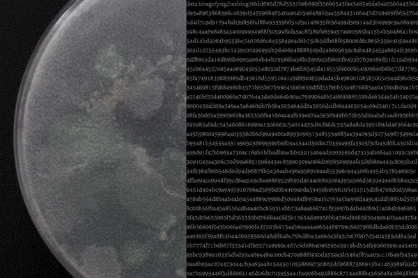

# bacteria-RNG

Currently the browser implementation loads image, randomises arbitrary string and displays random number 1-100. This is only to illustrate the idea! Made for [Akvile Terminaite](https://2020.rca.ac.uk/students/akvile-terminaite)'s *Bacteria as a Digital Mediator* (2020).

However, server/rng.py includes a difference hashing algorithm that is fully functional.

TO DO: write documentation, link rng.py to app, devise data feed from bacteria, further development, etc.
